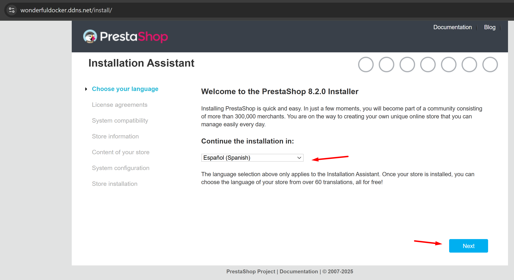
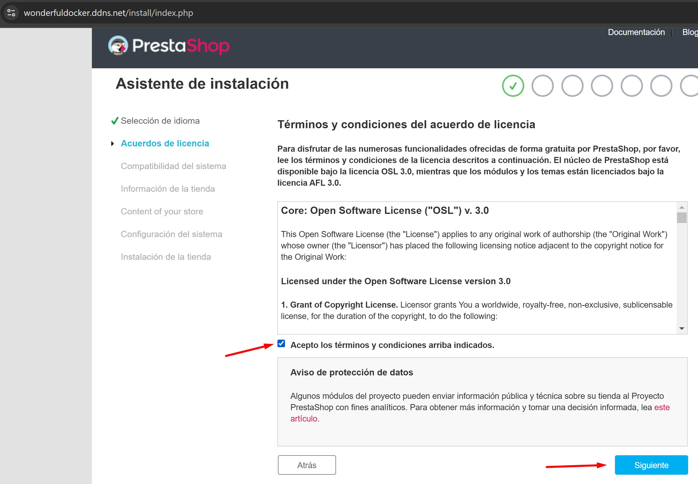
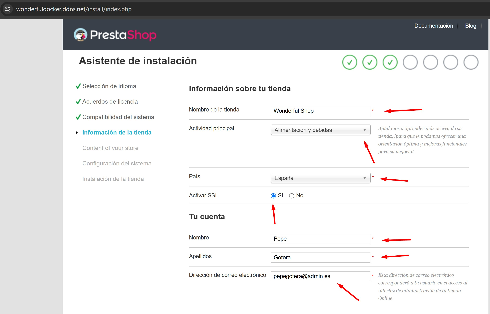
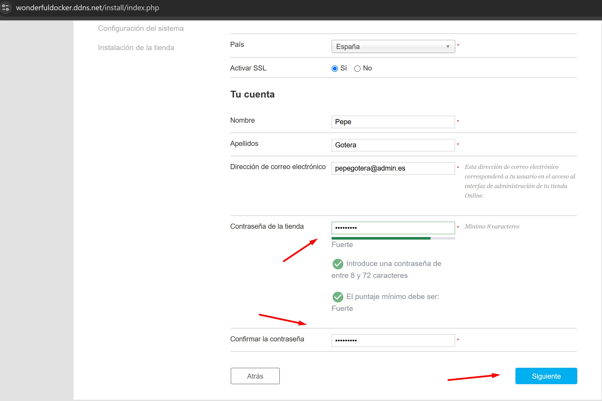
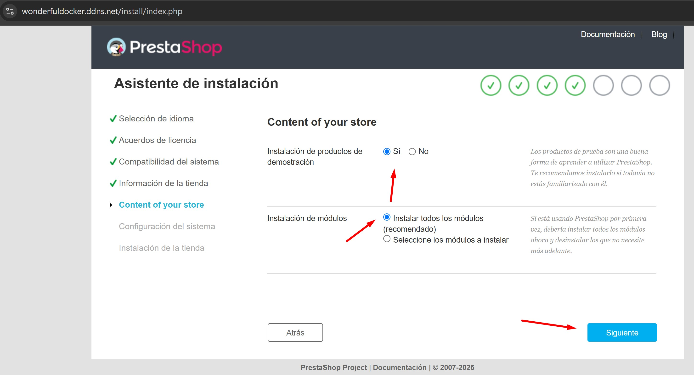
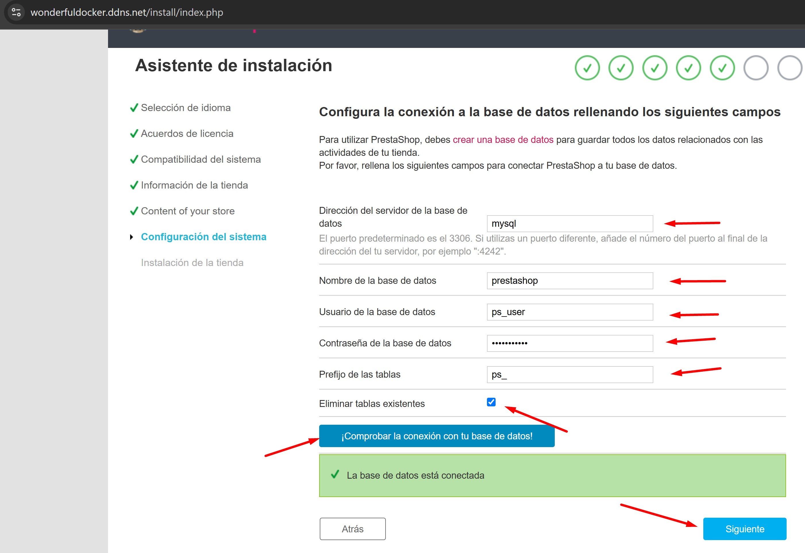
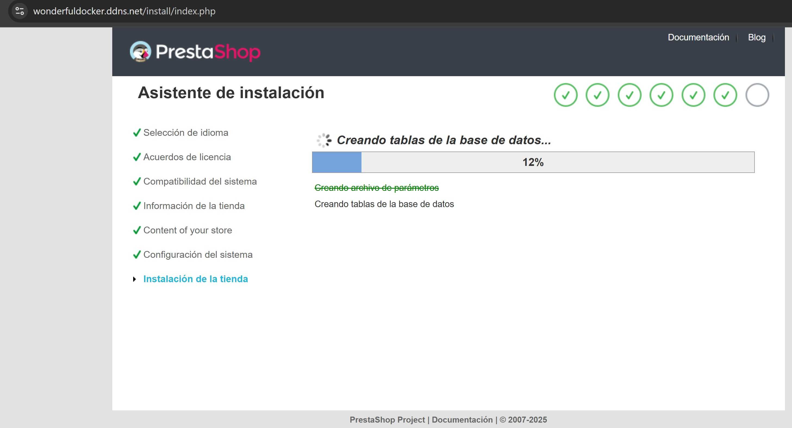

# Práctica 5.1: Despliegue de Prestashop con Docker y Docker Compose.

## Instrucciones.

### 1. Archivo "docker-compose.yml".

Se precisa de la creación de un archivo llamado ```docker-compose.yml```, el cual se encargará de realizar todo el despliegue de Prestashop según en siguiente código:
```
version: '3.4'

services:
  mysql:
    image: mysql:9.1
    ports: 
      - 3306:3306
    environment: 
      - MYSQL_ROOT_PASSWORD=${MYSQL_ROOT_PASSWORD}
      - MYSQL_DATABASE=${MYSQL_DATABASE}
      - MYSQL_USER=${MYSQL_USER}
      - MYSQL_PASSWORD=${MYSQL_PASSWORD}
    volumes: 
      - mysql_data:/var/lib/mysql
    networks: 
      - backend-network
    restart: always
  
  phpmyadmin:
    image: phpmyadmin:5.2.1
    ports:
      - 8080:80
    environment: 
      - PMA_ARBITRARY=1
    networks: 
      - backend-network
      - frontend-network
    restart: always
    depends_on: 
      - mysql

  prestashop:
    image: prestashop/prestashop:8
    environment: 
      - DB_SERVER=mysql
    volumes:
      - prestashop_data:/var/www/html
    networks: 
      - backend-network
      - frontend-network
    restart: always
    depends_on: 
      - mysql

  https-portal:
    image: steveltn/https-portal:1
    ports:
      - 80:80
      - 443:443
    restart: always
    environment:
      DOMAINS: "${DOMAIN} -> http://prestashop:80"
      STAGE: 'production' # Don't use production until staging works
      # FORCE_RENEW: 'true'
    networks:
      - frontend-network

volumes:
  mysql_data:
  prestashop_data:

networks: 
  backend-network:
  frontend-network:
```

A continuación se realizan diversas aclaraciones sobre el código mostrado.

Tal como se puede observar, el archivo se compone de tres apartados: servicios, volúmenes, y redes.

#### 1.1.Servicios.

Este fragmento del documento determina los contenedores que se van a ejecutar. Cada servicio corresponde a un contenedor o conjunto de contenedores basados en una imagen Docker específica. Dentro de cada servicio, se especificarán configuraciones como:

- *image*: es la imagen de Docker que el servicio utilizará.

- *ports*: se trata de un mapeo de puertos entre el contenedor y el host.

- *volumes*: ejecuta el montaje de volúmenes entre el host y el contenedor.

- *environment*: determina las variables de entorno para el contenedor. En este caso, se utilizarán variables que estarán almacenadas en un archivo ```.env``` que se describirá en el punto 2 de este texto.

- *depends_on*: son las dependencias entre servicios, por ejemplo, en este caso se ordena que el servicio ```mysql``` sea el primero en levantarse.

- *networks*: son las redes a las que pertenece el servicio.

- *restart*: determina si el servicio pude reiniciarse, estableciéndose en este caso un reinicio automático que volverá a levantar el contenedor en caso de interrupción de la actividad por cualquier motivo.

#### 1.2. Volúmenes.

Se detallan los volúmenes que se utilizarán para almacenar datos persistentes, es decir, los datos se guardarán incluso si el contenedor se elimina o reinicia. Asimismo, los volúmenes pueden ser compartidos entre múltiples contenedores. En este caso de emplean los volúmenes ```mysql_data``` y ```prestashop_data```.

#### 1.3. Redes.

Este apartado define las redes que los servicios utilizan para comunicarse. Docker Compose gestiona redes internas de manera predeterminada, aunque es posible crear redes con configuraciones personalizadas como, por ejemplo, control de subredes o aislamiento.

### 2. Archivo ".env".

Finalmente, será necesaria la creación de un archivo ```.env``` en el que se alamacenarán las siguientes variables:
```
MYSQL_ROOT_PASSWORD=
MYSQL_DATABASE=prestashop
MYSQL_USER=ps_user
MYSQL_PASSWORD=ps_password
DOMAIN=wonderfuldocker.ddns.net
```

Como se puede observar, las variables serán utilizadas por el archivo ```docker-compose.yml``` creado previamente para configurar Prestashop correctamente:

- ```MYSQL_ROOT_PASSWORD```: almacena la contraseña por defecto del usuario "root".
- ```MYSQL_DATABASE```: define el nombre de la base de datos a utilizar.
- ```MYSQL_USER```: guarda el nombre de usuario por defecto de la base de datos.
- ```MYSQL_PASSWORD```: guarda la contraseña del usuario por defecto reflejado enla variable anterior.
- ```DOMAIN=```: especifica el dominio público empleado por la página.


## Configuración de Prestashop.

A continuación se muestran una serie de capturas de pantalla con el objetivo de mostrar los pasos necesarios para completar la configuración inicial de Prestashop una vez se ha levantado el servicio.

1. Seleccione el idioma de instalación y pulse "Next".



2. Acepte las condiciones de servicio y pulse "Siguiente".



3. Escoja un nombre para su tienda, así como una actividad principal. También deberá especificar su país. Se debe activar SSL. Especifique nombre, apellidos y correo electrónico para la creación de una cuenta.



4. Finalmente, escoja una contraseña que cumpla los requerimientos mínimos de seguridad, y pulse "Siguiente".



5. Aquí puede escoger si desea que se le instale una platilla con productos de demostración. Por supuesto, se recomienda instalar todos los módulos. Pulse "Siguiente".



6. En primer lugar, y como se ha empleado mysql como sistema de base de datos, se escribirá "mysql" en el apartado "Dirección del servidor de la base de datos". A continuación, deberá rellenar los campos correspondientes con el contenido definido previamente en su archivo ```.env```. Escoja "ps_" como prefijo de las tablas. Marque la casilla para eliminar las tablas existentes. Compruebe la conexión con la base de datos, y si está conectad, pulse "Siguiente".



7. Espere a que finalice la instalación de su tienda.



8. La siguiente pantalla se mostrará una vez haya finalizado correctamente la instalación de su tienda.


