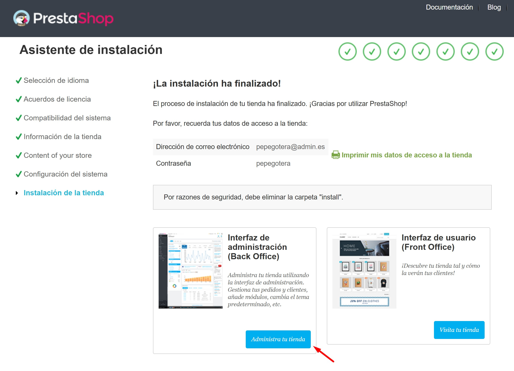

# Práctica 5.3: Despliegue de Prestashop con Docker y Docker Compose.

En primer lugar, se procederá con la instalación de Docker y Docker Compose en un sistema basado en Linux.

## 1. Instalación de Docker y Docker Compose.

A continuación, se facilitan una serie de comandos que permitirán al usuario instalar Docker y Docker Compose. Se ha elaborado un script de bash al que se ha llamado ```install_Docker.sh``` para automatizar la instalación.

```
#!/bin/bash

# Script de instalación de Docker y Docker Compose
# Referencia: https://docs.docker.com/engine/install/ubuntu/

set -x

# Actualizamos los repositorios
apt update

# Instalamos los paquetes necesarios para que `apt` pueda usar repositorios sobre HTTPS
apt install -y \
    ca-certificates \
    curl \
    gnupg \
    lsb-release

# Añadimos la clave GPG oficial de Docker
mkdir -p /etc/apt/keyrings
curl -fsSL https://download.docker.com/linux/ubuntu/gpg | gpg --dearmor -o /etc/apt/keyrings/docker.gpg

# Añadimos el repositorio oficial de Docker a nuestro sistema
echo \
  "deb [arch=$(dpkg --print-architecture) signed-by=/etc/apt/keyrings/docker.gpg] https://download.docker.com/linux/ubuntu \
  $(lsb_release -cs) stable" | sudo tee /etc/apt/sources.list.d/docker.list > /dev/null

# Actualizamos la lista de paquetes
apt update

# Instalamos la última versión de Docker y Docker Compose
apt install -y docker-ce docker-ce-cli containerd.io docker-compose-plugin

# Añadimos el usuario actual al grupo docker
usermod -aG docker $USER

# Habilitamos el servicio de Docker para que se inicie automáticamente al arrancar el sistema
systemctl enable docker

# Iniciamos el servicio de Docker
systemctl start docker
```

La ejecución del script se ha realizado con permisos de super usuario, es decir: 

- ```sudo ./install_Docker.sh```. Debido a esto, a continuación, se deben ejecutar los siguientes comandos:

- ```sudo usermod -aG docker ubuntu```: esto permite agregar el usuario "ubuntu" al grupo "docker", lo que permitirá ejecutar comandos de Docker sin necesidad de ser super usuario.

- ```newgrp docker```: esto mueve el grupo activo de tu sesión de terminal al grupo docker, evitando que se deba reiniciar la sesión tras haber agregado el usuario "ubuntu" al grupo "docker" con el comando anterior.

- ```docker pull ubuntu```: esto descargará la imagen oficial de Ubuntu desde Docker Hub a la máquina local. Esta imagen será necesaria para crear contenedores Ubuntu con Docker.


Finalmente, y para comprobar que Docker Compose está operativo, se ejecutará la instrucción ```docker compose```. Si se muestra la información que se aprecia en la siguiente imagen, significa que todo ha ido como se esperaba.


## 2. Archivo "docker-compose.yml".

Se precisa de la creación de un archivo llamado ```docker-compose.yml```, el cual se encargará de realizar todo el despliegue de Prestashop según en siguiente código:
```
version: '3.4'

services:
  mysql:
    image: mysql:9.1
    ports: 
      - 3306:3306
    environment: 
      - MYSQL_ROOT_PASSWORD=${MYSQL_ROOT_PASSWORD}
      - MYSQL_DATABASE=${MYSQL_DATABASE}
      - MYSQL_USER=${MYSQL_USER}
      - MYSQL_PASSWORD=${MYSQL_PASSWORD}
    volumes: 
      - mysql_data:/var/lib/mysql
    networks: 
      - backend-network
    restart: always
  
  phpmyadmin:
    image: phpmyadmin:5.2.1
    ports:
      - 8080:80
    environment: 
      - PMA_ARBITRARY=1
    networks: 
      - backend-network
      - frontend-network
    restart: always
    depends_on: 
      - mysql

  prestashop:
    image: prestashop/prestashop:8
    environment: 
      - DB_SERVER=mysql
    volumes:
      - prestashop_data:/var/www/html
    networks: 
      - backend-network
      - frontend-network
    restart: always
    depends_on: 
      - mysql

  https-portal:
    image: steveltn/https-portal:1
    ports:
      - 80:80
      - 443:443
    restart: always
    environment:
      DOMAINS: "${DOMAIN} -> http://prestashop:80"
      STAGE: 'production' # Don't use production until staging works
      # FORCE_RENEW: 'true'
    networks:
      - frontend-network

volumes:
  mysql_data:
  prestashop_data:

networks: 
  backend-network:
  frontend-network:
```

A continuación se realizan diversas aclaraciones sobre el código mostrado.

Tal como se puede observar, el archivo se compone de tres apartados: servicios, volúmenes, y redes.

### 2.1.Servicios.

Este fragmento del documento determina los contenedores que se van a ejecutar. Cada servicio corresponde a un contenedor o conjunto de contenedores basados en una imagen Docker específica. Dentro de cada servicio, se especificarán configuraciones como:

- *image*: es la imagen de Docker que el servicio utilizará.

- *ports*: se trata de un mapeo de puertos entre el contenedor y el host.

- *volumes*: ejecuta el montaje de volúmenes entre el host y el contenedor.

- *environment*: determina las variables de entorno para el contenedor. En este caso, se utilizarán variables que estarán almacenadas en un archivo ```.env``` que se describirá en el punto 2 de este texto.

- *depends_on*: son las dependencias entre servicios, por ejemplo, en este caso se ordena que el servicio ```mysql``` sea el primero en levantarse.

- *networks*: son las redes a las que pertenece el servicio.

- *restart*: determina si el servicio pude reiniciarse, estableciéndose en este caso un reinicio automático que volverá a levantar el contenedor en caso de interrupción de la actividad por cualquier motivo.

### 2.2. Volúmenes.

Se detallan los volúmenes que se utilizarán para almacenar datos persistentes, es decir, los datos se guardarán incluso si el contenedor se elimina o reinicia. Asimismo, los volúmenes pueden ser compartidos entre múltiples contenedores. En este caso de emplean los volúmenes ```mysql_data``` y ```prestashop_data```.

### 2.3. Redes.

Este apartado define las redes que los servicios utilizan para comunicarse. Docker Compose gestiona redes internas de manera predeterminada, aunque es posible crear redes con configuraciones personalizadas como, por ejemplo, control de subredes o aislamiento.

## 3. Configuración de puertos para la gestión del tráfico en red.

A continuación, y debido a los servicios que se van a levantar en el archivo "docker-compose.yml", tal como se ha visto en el apartado anterior, será necesario abrir los puertos correspondientes con respecto al tráfico de entrada, siendo en este caso:

- ***SSH*** (TCP): puerto ```22```. Permite la conexión por ssh al servidor.
- ***HTTP*** (TCP): puerto ```80```. Permite acceder al servicio mediante el protocolo HTTP.
- ***HTTPS*** (TCP): puerto ```443```. Permite acceder al servicio mediante el protocolo HTTPS.
- ***phpMyAdmin*** (TCP): puerto ```8080```. Permite la comunicación con phpMyAdmin, el gestor web de MySQL.

Además, se debe tener en cuenta que se permitirá todo el tráfico de salida.


## 4. Archivo ".env".

Finalmente, será necesaria la creación de un archivo ```.env``` en el que se alamacenarán las siguientes variables:
```
MYSQL_ROOT_PASSWORD=
MYSQL_DATABASE=prestashop
MYSQL_USER=ps_user
MYSQL_PASSWORD=ps_password
DOMAIN=wonderfuldocker.ddns.net
```

Como se puede observar, las variables serán utilizadas por el archivo ```docker-compose.yml``` creado previamente para configurar Prestashop correctamente:

- ```MYSQL_ROOT_PASSWORD```: almacena la contraseña por defecto del usuario "root".
- ```MYSQL_DATABASE```: define el nombre de la base de datos a utilizar.
- ```MYSQL_USER```: guarda el nombre de usuario por defecto de la base de datos.
- ```MYSQL_PASSWORD```: guarda la contraseña del usuario por defecto reflejado enla variable anterior.
- ```DOMAIN=```: especifica el dominio público empleado por la página.

## 5. Ejecución del archivo "docker-compose.yml".

Llegado a este punto, y teniendo los dos archivos necesarios para este procedimiento correctamente preparados (```docker-compose.yml``` y ```.env```), el usuario debe proceder con la ejecución del archivo con extensión "yml" mediante el comando ```docker-compose up -d```. Desgraciadamente, es posible que se muestre un error que informa del desconocimiento de este comando; si es el caso, se deberá instalar el paquete para poder hacer uso de dicho comando, para lo que se debe ejecutar la instrucción ```sudo apt install docker-compose```.


Una vez hecho esto, ya será posible levantar todo lo dispuesto en el archivo ```docker-compose.yml```, siendo únicamente necesario escribir ```docker-compose up -d``` y pulsar intro.


El proceso acabará mostrando lo siguiente por consola.


## 6. Configuración de Prestashop.

A continuación se muestran una serie de capturas de pantalla con el objetivo de mostrar los pasos necesarios para completar la configuración inicial de Prestashop una vez se ha levantado el servicio.

1. Seleccione el idioma de instalación y pulse "Next".


2. Acepte las condiciones de servicio y pulse "Siguiente".


3. Escoja un nombre para su tienda, así como una actividad principal. También deberá especificar su país. Se debe activar SSL. Especifique nombre, apellidos y correo electrónico para la creación de una cuenta.


4. Finalmente, escoja una contraseña que cumpla los requerimientos mínimos de seguridad, y pulse "Siguiente".


5. Aquí puede escoger si desea que se le instale una platilla con productos de demostración. Por supuesto, se recomienda instalar todos los módulos. Pulse "Siguiente".


6. En primer lugar, y como se ha empleado mysql como sistema de base de datos, se escribirá "mysql" en el apartado "Dirección del servidor de la base de datos". A continuación, deberá rellenar los campos correspondientes con el contenido definido previamente en su archivo ```.env```. Escoja "ps_" como prefijo de las tablas. Marque la casilla para eliminar las tablas existentes. Compruebe la conexión con la base de datos, y si está conectad, pulse "Siguiente".


7. Espere a que finalice la instalación de su tienda.


8. La siguiente pantalla se mostrará una vez haya finalizado correctamente la instalación de su tienda.




